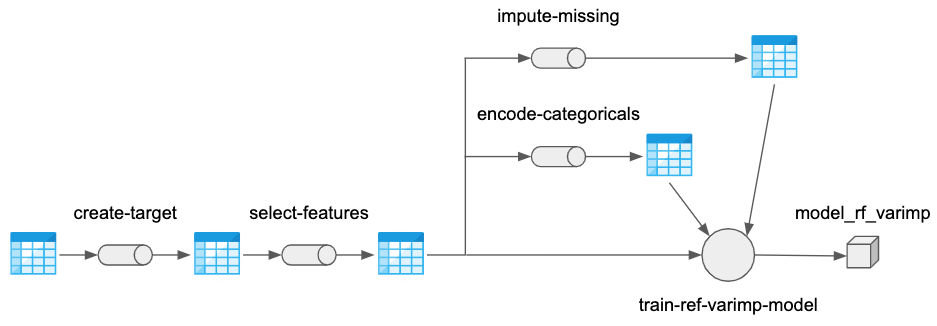
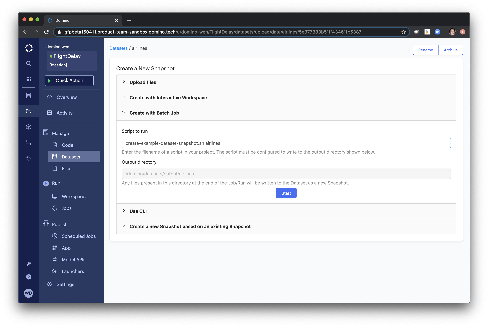
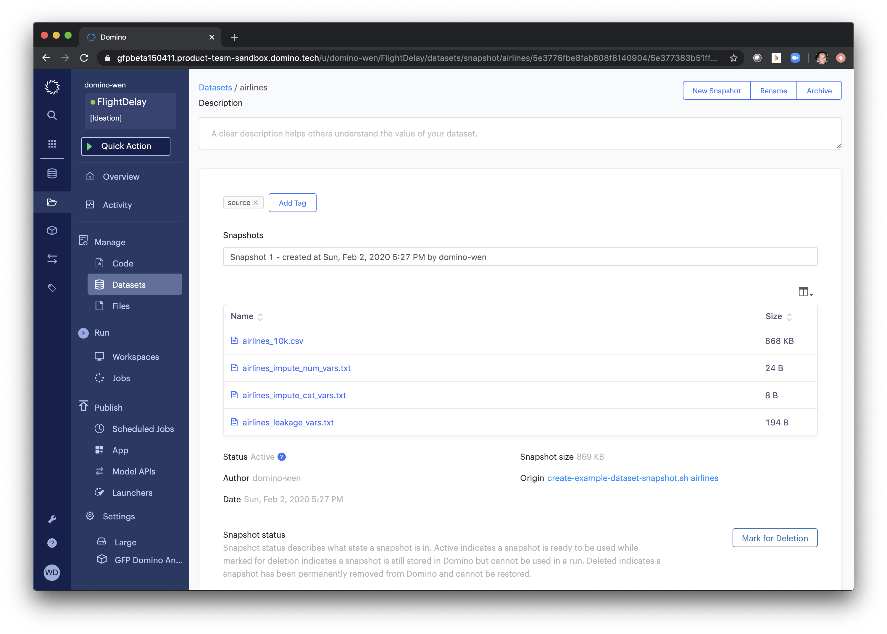
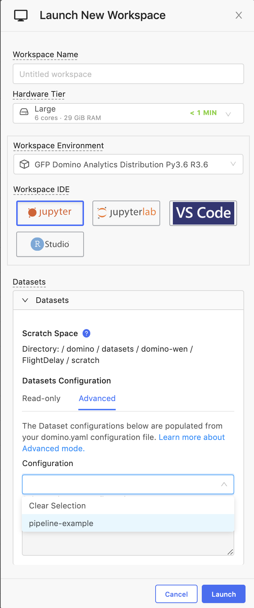
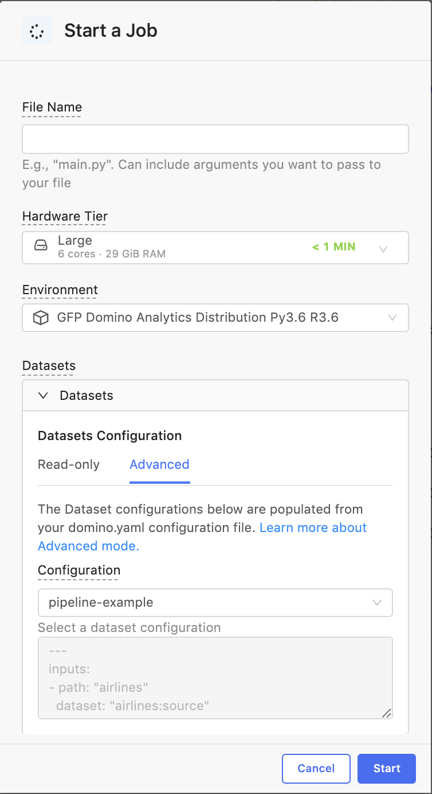
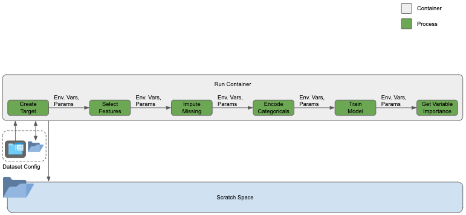
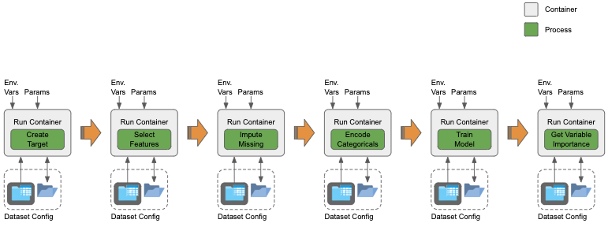
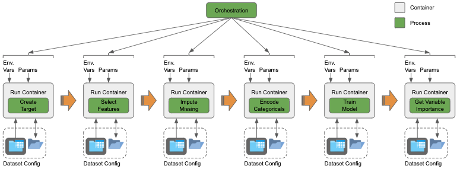

# Overview
This is an example project is based on airline flight on-time performance data.  A series of machine learning (ML) pipeline stages have been created to take an input data set and train a reference ML model for variable importance.  In this case, a Random Forest model is trained because of its simplicity and ability to capture non-linear effects.

# Quickstart
1. Set working directory (repo directory) environment variable: `export PATH_WD=/path/to/your/working/directory`
2. Change into your working directory: `cd $PATH_WD`
3. Configure your python environment (inside a `virtualenv` is recommended): `pip install -r requirements.txt`
4. Run pipeline locally with example data: `bash run-pipeline-local.sh`

# Data
The data is mmade available by hte Research and Innovative Technology Administratione (RITA) and Bureau of Transportation Statistics (BoTS) of the United States Department of Transportation (USDoT).  You can be found at [http://stat-computing.org/dataexpo/2009/the-data.html](http://stat-computing.orunningexpo/2009/the-data.html).

# Pipeline
The baseline pipeline is shown below.

Here's a summary of each stage:
1. `create-target`: Create a target variable
2. `select-features`: Select features
3. `encoder-categoricals`: Create numeric encodings of categorical variables
4. `impute-misssing`: For columns of missing values, create new columns with missing values imputed.
5. `train-ref-varimp-model`: Combine baseline data frame with selected features with encoded categorical variables and imputed columns.  Remove unnecessary columns to present a modeling table to the model training algorithm.  Train referenc model (i.e. random forest) to extract variable importance.

The details of each pipeline stage is described below.

### Create Target (`create-target`)
  * **File**: `create-target.py`
  * **Description**: Creates `IsDelayed` target variable from `ArrDelay`.
  * **Inputs**
    * Data: `$INPUT_DATA`
  * **Outputs**
    * Data: `airlines_small_target.feather`

### Select Features (`select-features`)
  * **File**: `select-features.py`
  * **Description**: Selects features
  * **Inputs**
    * Data: `airlines_leakage_vars.txt`
  * **Outputs**
    * Data: `airlines_small_target_selected.feather`

### Imput Missing (`impute-missing`)
  * **File**: `impute-missing.py`
  * **Description**: Imputes missing values.  Mean imputation for numeric variables.  Creates a `-1` missing value for categorical variables.  Imputed columns are saved to disk.  Imputers are serialized as pickle files and saved to disk.
  * **Inputs**
    * Data: `airlines_impute_num_vars.txt`, `airlines_impute_cat_vars.txt`
  * **Outputs**
    * Data: `airlines_small_imp_num.feather`, `airlines_small_imp_cat.feather`
    * Artifacts: `imp_mean.pkl`, `imp_cat.pkl`

### Encode Categoricals (`encode-categoricals`)
  * **File**: `encode-categoricals.py`
  * **Description**: Label and one-hot encodes categorical features.  Encoded columns are saved to disk as pickled sparse matrices.  Encoders are serialized as pickle files and saved to disk.  Label encoded values are column-binded to the original input data table and saved to disk.
  * **Inputs**
    * Data: `airlines_small_target_selected.feather`
  * **Outputs**
    * Data: `{var}_oe_sp.pkl` for encoded categorical `var`, `airlines_small_target_selected_le.feather`
    * Artifacts: `{var}_le.pkl` label encoder for categorical `var`, `{var}_oe.pkl` one-hot encoder for categorical `var`

### Train Reference Variable Importance Model (`train-ref-varimp-model.py`)
  * **File**: `train-ref-varimp-model.py`
  * **Description**: Combines imputed and encoded columns with base selected features for modeling table.  Train random forest model and saves serialized pickle file to disk.
  * **Inputs**
    * Data: `airlines_small_target_selected_le.feather`, `airlines_small_imp_num.feather`, `airlines_small_imp_cat.feather`, `airlines_impute_num_vars.txt`, `airlines_impute_cat_vars.txt`, `{var}_oe_sp.pkl` for encoded categorical `var`
  * **Outputs**
    * Artifacts: `model_rf_varimp.pkl`

# Datasets
`airlines_small.csv`
`airlines_leakage_vars.txt`
`airlines_impute_num_vars.txt`
`airlines_impute_cat_vars.txt`

`airlines_10k.csv`

## Create Dataset Snapshot
1. Create a Dataset

2. Create new Snapshot

`create-example-dataset-snapshot.sh`
Moves `domino.yaml` into Domino Filesystem

## Launching with Dataset Configuration
`pipeline-example`

# Environments
`pip install -r requirements.txt`

# Running the Pipeline
The code is written to be as agnostic to runtime environment as possible.  To that extent, the working directory (`$PATH_WD`) and paths to code, data, and artifacts are all parameterized with environment variables.

Assuming a complete runtime environment with the necessary libraries, you should be able to run this project on your laptop and then with simply a change in environment variables, run the project into another environment, such as Domino.

| Input Data | Derived Data | Runtime Environment | Instructions |
| --- | --- | --- | --- |
| Repo | Local | Local | Export `PATH_WD` to your local working directory. Run `bash run-pipeline.sh`. |
| Repo | Scratch Space | Domino Workspace | Run `bash run-pipeline.sh domino-workspace-ex`. |
| Dataset | Scratch Space | Domino Workspace | Run `bash run-pipeline.sh domino-workspace-ex-dataset`. |
| Repo | N/A| Domino Job | Run `bash run-pipeline.sh domino-job-ex`. |
| Dataset | N/A| Domino Job | Run `bash run-pipeline.sh domino-job-ex-dataset`. |

All cases with a Dataset assumes an input data tagged `source`.

### Environment Variables
The environment variables are:
* `PATH_WD`
* `INPUT_DATA`
* `PATH_INPUT_DATA`
* `PATH_OUTPUT_DATA`
* `PATH_INPUT_ARTIFACTS`
* `PATH_OUTPUT_ARTIFACTS`

### Configuration

#### Domino Workspace
In a Domino Workspace, we assume the following:
1. A single Dataset configuration (i.e. static Dataset mount points throughout the life of the Workspace)
2. The availability of a Dataset Scratch Space

Hence, 

#### Domino Job

